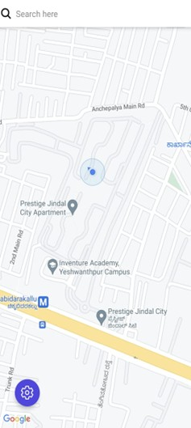
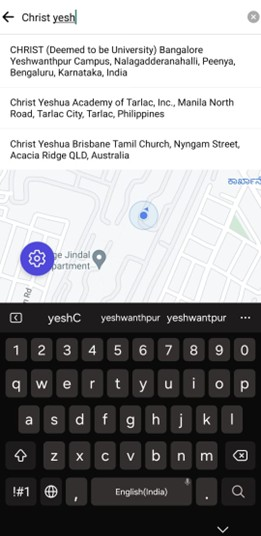
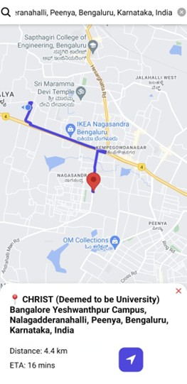
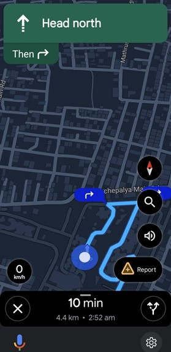
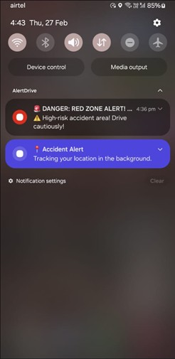
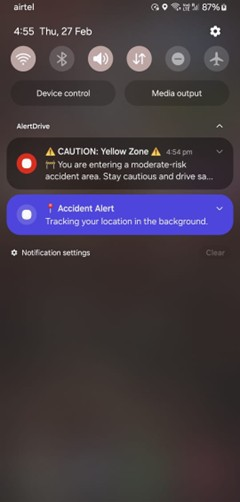
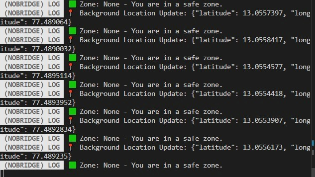

# AlertDrive - Real-Time Accident-Prone Area Alert System

AlertDrive is a mobile application designed to improve road safety by **providing real-time alerts** when users enter accident-prone areas. Unlike traditional navigation apps that focus on route optimization, AlertDrive integrates **machine learning models with geospatial accident data** to predict hazardous zones and notify drivers instantly. The app operates in the background, ensuring **non-intrusive notifications** that appear even when users are using external navigation apps like Google Maps.

## Key Features

### User Features
- **Real-time location tracking** using background GPS monitoring.
- **Accident-prone zone alerts** with push notifications.
- **Severity-based warnings** (Red for high-risk, Yellow for caution).
- **Live Google Maps navigation** with integrated hazard alerts.
- **Search functionality** to find locations and plan routes.
- **Overlay notifications** ensuring alerts appear even when using Google Maps.
- **Battery-efficient tracking** optimized with Expo Location API.

### Safety Features
- **Automated alerts** triggered when users enter accident zones.
- **Route analysis** to provide the safest path.
- **Traffic data integration** for real-time hazard detection.
- **Emergency reporting system** for users to notify authorities.

## System Architecture

- **Frontend:** React Native (Expo) for mobile development.
- **Backend:** Node.js (Express.js) for processing and API handling.
- **Database:** MongoDB (Geospatial Indexing) for accident-prone area storage.
- **Maps & Navigation:** Google Maps API for real-time traffic updates and routing.
- **State Management:** Zustand for lightweight global state handling.
- **Push Notifications:** Expo Notifications API for instant alerts.

## Screenshots

### User Views

#### Standard Mode


#### Search Functionality


#### Route Planning


#### Navigation Screen


#### Red Zone Alert


#### Yellow Zone Alert


#### Log Output


## Installation Instructions

1. Clone the repository:
   ```bash
   git clone https://github.com/your-username/AlertDrive.git
   cd AlertDrive
   
2. Set up the Backend:
   - Navigate to the `backend/` folder.
   - Install dependencies:
     ```bash
      npm install
   - Set up MongoDB Atlas and add the database connection string in `.env`:
     ```bash
     MONGO_URI=your_mongodb_connection_string
   - Start the backend server:
     ```bash
     npm start

3. Set up the Frontend:
   - Navigate to the `frontend/` folder.
   - Install dependencies:
     ```bash
      npm install
   - Run the Expo development server:
     ```bash
     npx expo start

## API Endpoints

### **User Location Tracking**
- **POST `/api/check-location`**
  - **Description:** Checks if a user is inside an accident-prone zone.
  - **Request Body:**
    ```json
    {
      "lat": 12.971598,
      "lng": 77.594566
    }
    ```
  - **Response:**
    ```json
    {
      "zone": "Red",
      "message": "You are in a high accident-prone area!"
    }
    ```

### **Route Navigation**
- **GET `/api/directions`**
  - **Description:** Fetches the safest route avoiding accident zones.
  - **Request Params:**
    ```
    origin=12.971598,77.594566&destination=12.2958,76.6394
    ```
  - **Response:**
    ```json
    {
      "distance": "120 km",
      "duration": "2 hours 30 minutes",
      "route": "Polyline_encoded_string"
    }
    ```

## Testing

### **Unit Testing**
- **Location Tracking Module:** Ensures Expo Location API correctly retrieves real-time coordinates.
- **Backend Processing Module:** Verifies MongoDB geospatial queries correctly identify accident zones.
- **Notification Module:** Ensures push notifications are triggered instantly when entering hazardous areas.

### **Integration Testing**
- Validates seamless communication between the **frontend**, **backend**, and **database**.
- Ensures overlay notifications **appear correctly over navigation apps** like Google Maps.

### **User Testing**
- Tested in **urban and highway environments** to verify real-time hazard alerts.
- Optimized for **minimal battery drain** while running in the background.

## Future Enhancements
- **Integration with weather data** to warn users about hazardous conditions.
- **AI-based predictive modelling** to improve accident zone detection.
- **Offline functionality** for areas with poor internet connectivity.
- **Emergency services integration** for automated reporting of accidents.

## Authors
- **Nawang Dorjee**

